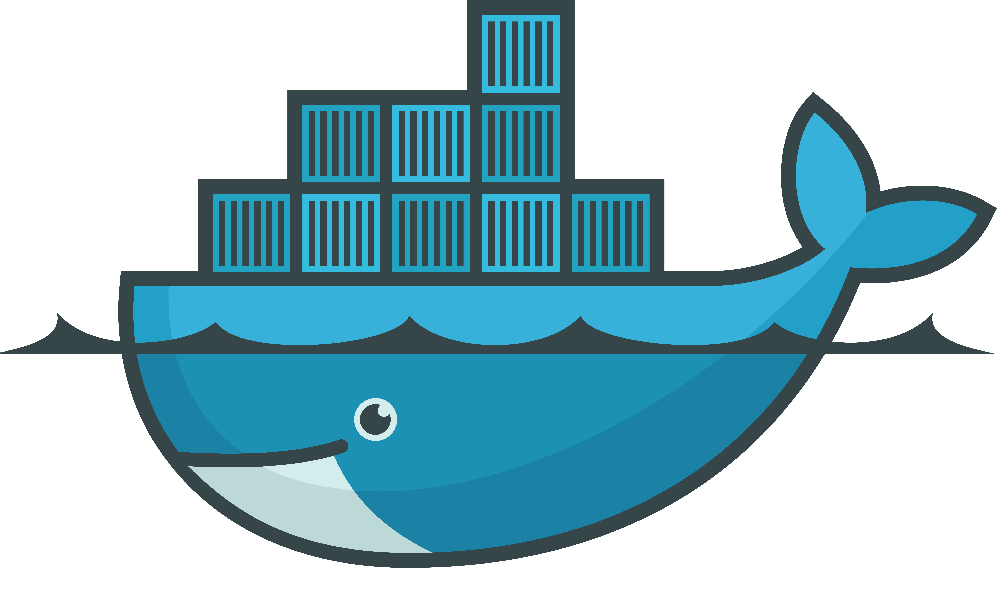

# The Staries :sparkles:
The *ies. A series of &lt;star>-ies util snippets, scripts or templates that I use day to day.

 

> ##    [_Remain undocumented, nothing should._](http://starlogs.net/#cgpu/staries)

 

- 

- 

- 

- 

- 

- 

- 

- 

- 

- 

- 

- 

- 

- 

## Contributors ✨

Thanks goes to these wonderful people ([emoji key](https://allcontributors.org/docs/en/emoji-key)):

<!-- ALL-CONTRIBUTORS-LIST:START - Do not remove or modify this section -->
<!-- prettier-ignore-start -->
<!-- markdownlint-disable -->
<table>
  <tr>
    <td align="center"><a href="https://github.com/cgpu"> <b>cgpu</b></a> <a href="https://github.com/cgpu/staries/commits?author=cgpu" title="Documentation">📖</a></td>
    <td align="center"><a href="https://github.com/gcpu"> <b>gcpu</b></a> <a href="https://github.com/cgpu/staries/pulls?q=is%3Apr+reviewed-by%3Agcpu" title="Reviewed Pull Requests">👀</a></td>
  </tr>
</table>

<!-- markdownlint-restore -->
<!-- prettier-ignore-end -->

<!-- ALL-CONTRIBUTORS-LIST:END -->

This project follows the [all-contributors](https://github.com/all-contributors/all-contributors)
specification. Contributions of any kind welcome!

[enabling-debug-logging]: https://docs.github.com/en/actions/managing-workflow-runs/enabling-debug-logging
